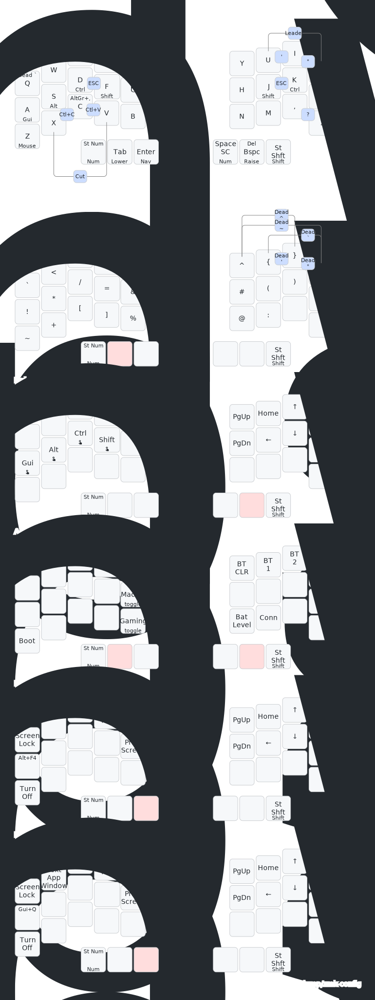

# ZMK Config

Personal [ZMK firmware](https://github.com/zmkfirmware/zmk/) configuration for split keyboards with trackball support.

The configuration tracks ZMK `main` branch, extended by various ZMK modules. All build dependencies are pinned in the [`west` manifest](config/west.yml).

> **Note:** This configuration is based on [urob's zmk-config](https://github.com/urob/zmk-config). Refer to that repository for detailed explanations of the keymap features (timeless homerow mods, combos, smart layers, etc.).

## Keyboards

- **Crosses** - 36-key split keyboard with PMW3610 trackball, Nice!Nano v2, OLED displays
- **Prospector Scanner** - Xiao BLE display module

## Highlights

- "Timeless" homerow mods
- Combos instead of symbol layer
- Auto-toggle off numbers and mouse layers
- Magic thumb quadrupling as Repeat/Sticky-shift/Capsword/Shift
- Leader key sequences for Unicode input and system commands
- Trackball with scroll snapping and snipe mode
- ZMK Studio support (right half)



(Powered by [keymap-drawer](https://github.com/caksoylar/keymap-drawer).)

## Local build environment

The build process uses `mise`, `uv`, `just`, and `west` to manage dependencies and build firmware.

### Pre-requisites

1. Install [mise](https://mise.jdx.dev/):

   ```bash
   curl https://mise.run | sh
   ```

2. Install system dependencies:

   ```bash
   # Debian/Ubuntu
   sudo apt install git gperf ccache dfu-util device-tree-compiler wget xz-utils file make gcc gcc-multilib

   # macOS
   brew install gperf ccache dfu-util dtc wget
   ```

### Setup

1. Clone this repository:

   ```bash
   git clone <your-repo-url> zmk-workspace
   cd zmk-workspace
   ```

2. Activate mise and install tools (uv, just, cmake, ninja):

   ```bash
   mise trust
   mise install
   ```

3. Run setup to create Python venv, install dependencies, and Zephyr SDK:

   ```bash
   just setup
   ```

4. Initialize west workspace:

   ```bash
   just init
   ```

### Usage

```
zmk-workspace/
├── config/             # Keyboard configuration (keymap, combos, etc.)
├── draw/               # Keymap visualization
├── firmware/           # Compiled .uf2 files (after building)
├── gggw-zmk-keebs/     # Hardware definitions (fetched by west)
├── modules/            # ZMK modules (fetched by west)
├── zephyr/             # Zephyr RTOS (fetched by west)
└── zmk/                # ZMK firmware (fetched by west)
```

#### Building

```bash
just build all          # Build all targets in build.yaml
just build crosses      # Build Crosses keyboard (left + right)
just build prospector   # Build Prospector Scanner
just list               # List all valid build targets
just build all -p       # Pristine build
just clean              # Clear build cache
```

#### Drawing the keymap

```bash
just draw               # Generates draw/crosses.svg
```

#### Updating

```bash
just update             # Update ZMK and modules from west.yml
```

## Related resources

- [ZMK Documentation](https://zmk.dev/docs)
- [urob's zmk-config](https://github.com/urob/zmk-config) - Original configuration with detailed feature explanations
- [gggw-zmk-keebs](https://github.com/Good-Great-Grand-Wonderful/gggw-zmk-keebs) - Crosses hardware definitions
